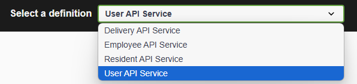
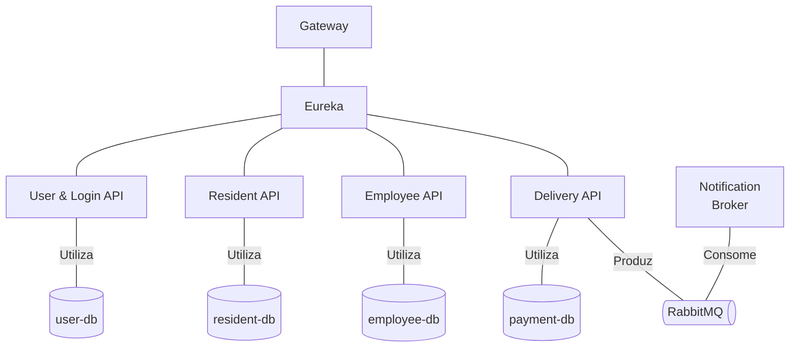
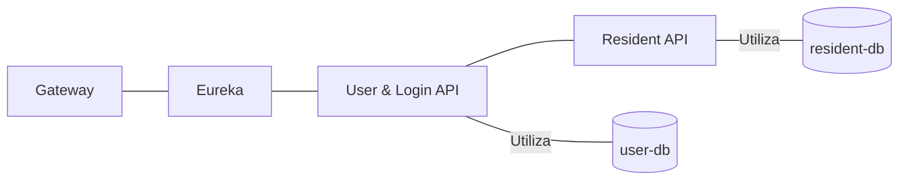
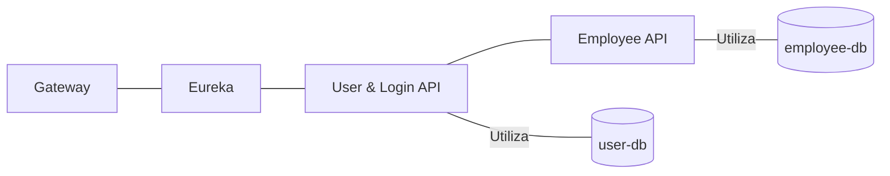

# Tech Challenge - Substitutiva

Esse projeto é referente a uma atividade substitutiva da Pós Tech em Java da FIAP.

## Tecnologias Usadas

- Java 17
- Spring
- Maven
- PostgreSQL
- Docker
- Docker Compose

## Configuração

Para que não tenha problemas de conflitos com portas já sendo usadas, sugiro conferir o arquivo docker-compose.yml e avaliar as portas.

Caso altere, certifique-se que foram feitas as alterações em todos os locais necessários, para que todos serviços sejam executados de maneira correta.

## Subindo os containers

Com docker e docker compose instalados na máquina, execute o comando abaixo na raiz do projeto:


```shell
docker compose up --build
```

Este comando é suficiente para executar o projeto. A geração dos arquivos .jar das APIs é feita através de uma imagem do Docker.

```docker
# Etapa 1: Compilar a aplicação
FROM maven:3.8.4-openjdk-17 AS build
WORKDIR /app
COPY pom.xml .
COPY src ./src
RUN mvn clean package -DskipTests

# Etapa 2: Criar a imagem final
FROM openjdk:17-jdk-slim
WORKDIR /app
COPY --from=build /app/target/gateway-0.0.1-SNAPSHOT.jar app.jar
ENTRYPOINT ["java", "-jar", "app.jar"]
```
Após subir o docker compose, aguardar pelo menos 1 minuto para que todos as api's se registrem no Eureka.

## Testes

### Unitários

Para avaliar os testes unitários, execute para cada serviço:

```bash
./mvnw clean test
```

Logo após a execução, olhe o diretório:

```
target/
└── site/
    └── jacoco/
        └── index.html
```

Além dos testes unitários, há um projeto de testes e2e, com nome **e2etest**.

Este projeto conecta-se na porta 8080 e pode fazer os seguintes testes:

- Testar todo fluxo de cadastro de Residentes (Resident API)
- Testar todo fluxo de cadastro de Porteiros (Employee API)
- Testar todo fluxo de delivery:
     - Criar um residente
     - Criar um Porteiro
     - Gerar token de acesso para ambos
     - Realizar o registro de um pacote
     - Residente ler a mensagem de que o pacote chegou
     - Realizar a retirada do pacote.

Para executar o projeto, entre no diretório e execute:

```shell
./mvnw clean test
```


## Swagger

O swagger se encontra em: http://localhost:8080/swagger-ui.html

No menu superior vai ser exibido a documentação das APIs.



## Arquitetura:

Todos os serviços se conectam ao Eureka. E a porta de entrada é o gateway.
Ou seja, para usuários externos, a entrada é o gateway.



Além disso, cada as API's:

- User API
- Resident API
- Employee API
- Delivery API

Possuem banco de dados.

E os serviços:

- Delivery API
- Notification Broker

Se conectam ao RabbitMQ.

# Regras de negócio

## Fluxos

### 1 - Criar usuários

Para iniciar, deve se criar dois usuários:

- Morador
- Porteiro

Para cadastrar um morador, deve ser usado o ```/api/user/resident```:

```bash
curl -X 'POST' \
  'http://localhost:8080/api/user/resident' \
  -H 'accept: application/json' \
  -H 'Content-Type: application/json' \
  -d '{
  "name": "string",
  "document": "string",
  "cellphone": "string",
  "apartment": 0
}'
```

A saída será o celular e uma senha.

```json
{
    "cellphone": "+60 17 24993-1225",
    "password": "*Q1$^V0rc8"
}
```

Isso foi pensado para que o usuário n se preocupe com a criação de senhas seguras, já que a senha criada já atende os critérios de segurança.

Para cadastrar um porteiro, deve ser usado o ```/api/user/employee```:

```bash
curl -X 'POST' \
  'http://localhost:8080/api/user/employee' \
  -H 'accept: application/json' \
  -H 'Content-Type: application/json' \
  -d '{
  "name": "string",
  "document": "string",
  "cellphone": "string"
}'
```

A saída será o celular e uma senha.

```json
{
    "cellphone": "+60 17 24993-1225",
    "password": "*Q1$^V0rc8"
}
```

Isso foi pensado para que o usuário n se preocupe com a criação de senhas seguras, já que a senha criada já atende os critérios de segurança.

O fluxo entre os serviços é:

1. Para o cadastro de um morador, o serviço User API chama o Resident API;
2. Para o cadastro de um porteiro, o serviço User API chama o Resident API;
3. Em ambos processos, é validado se já não tem um usuário com o celular registrado;
4. No cadastro do morador, é verificado se há o documento ou apartamento registrado;
5. No cadastro do porteiro, é verificado se há o celuar registrado;
6. Caso os critérios tenham sido atendidos, é gerado um novo usuário


Morador:



Porteiro:



### 2 - Gerar token

## Controle de acesso

O controle de acesso das API's são feitas através do gateway, ou seja, nenhuma API tem validação de roles, ficando tudo concentrado no gateway.
Esta decisão foi tomada para centralizar as regras de acesso.

A Matriz RACI abaixo demonstra os Paths, http methods e Roles que podem acessar de fora, pelo Gateway.
Caso o Method esteja preenchido com - (hífen) siignifica que todos os métodos estão na regra.
Caso a Role esteja preenchido com - (hífen) siignifica que não é necessário autenticação.


| Ações                                                            | Path                                    | Method     | AuthenticatorFilter       |
|------------------------------------------------------------------|-----------------------------------------|------------|---------------------------|
|Criação de usuários                                               | /api/user/**                            | POST       | -                         |
|Login, para gerar token                                           | /api/login                              | -          | -                         |
|Validar token                                                     | /api/login/validate                     | -          | -                         |
|Criar, alterar, selecionar e excluir <br> moradores               | /api/resident/**                        | -          | RESIDENT,EMPLOYEE         |
|Criar, alterar, selecionar e excluir <br> porteiros               | /api/employee/**                        | -          | EMPLOYEE                  |
|Registrar que um pacote chegou                                    | /api/delivery/register                  | POST       | EMPLOYEE                  |
|Registrar que um pacote foi entregue                              | /api/delivery/{id}/delivered            | PUT        | EMPLOYEE                  |
|Registrar que o morador leu a notificação <br> que o pacote chegou| /api/delivery/{id}/notification/read    | PUT        | RESIDENT                  |
|Verificar as entregas por ID ou por Apartamento                   | /api/delivery/**                        | GET        | EMPLOYEE,RESIDENT         |
|Swagger do serviço de User                                        | /user-api/v3/api-docs                   | -          | -                         |
|Swagger do serviço de Moradores                                   | /resident-api/v3/api-docs               | -          | -                         |
|Swagger do serviço de Porteiros                                   | /employee-api/v3/api-docs               | -          | -                         |
|Swagger do serviço de Delivery                                    | /delivery-api/v3/api-docs               | -          | -                         |


Essas regras podem serem vistas no arquivo ```application.yml```, dentro do gateway.


```
gateway/
└── src/
    └── main/
        └── resources
                └── application.yml
```

# Dúvidas?

Poste aqui sua issue ou me mande um email: rafael.ferper@gmail.com